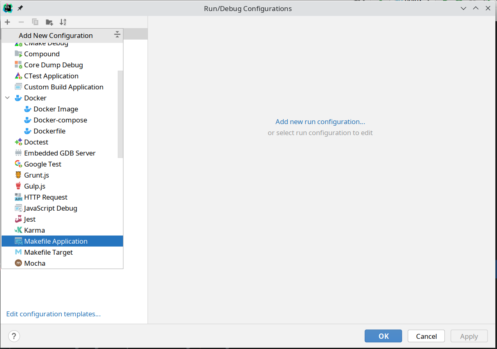
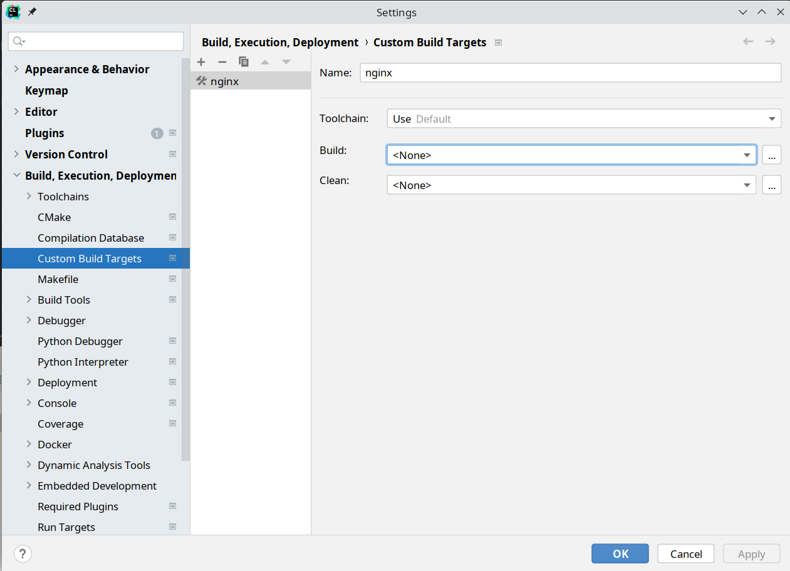
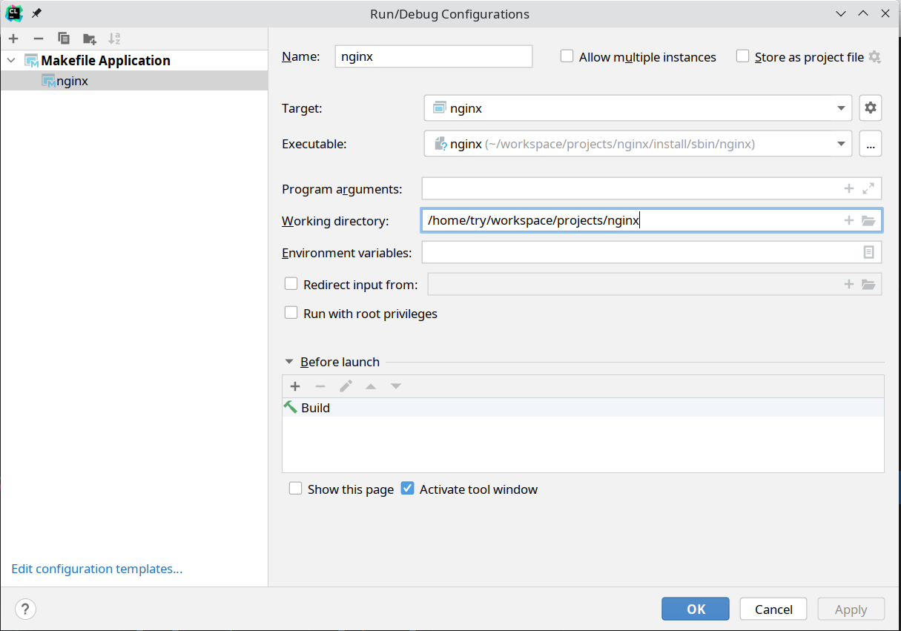

## prepare source

```bash
git clone git@github.com:nginx/nginx
``

## compile

```bash
cd nginx
mkdir install

./auto/configure \
       --prefix=install\
       --with-poll_module\
       --with-threads\
       --with-file-aio\
       --with-http_ssl_module\
       --with-http_v2_module\
       --with-http_realip_module\
       --with-http_mp4_module\
       --with-http_gunzip_module\
       --with-http_gzip_static_module\
       --with-http_auth_request_module\
       --with-http_random_index_module\
       --with-http_secure_link_module\
       --with-http_degradation_module\
       --with-http_slice_module\
       --with-http_stub_status_module\
       --with-stream\
       --with-stream_ssl_module\
       --with-stream_realip_module\
       --with-stream_geoip_module
       
make
make install

```

## CLion

#### create run/debug configuration
	
Add a new `Makefile Application`.




Create a new `Custom Build Targets`.



Choose executable file and set working directory.




